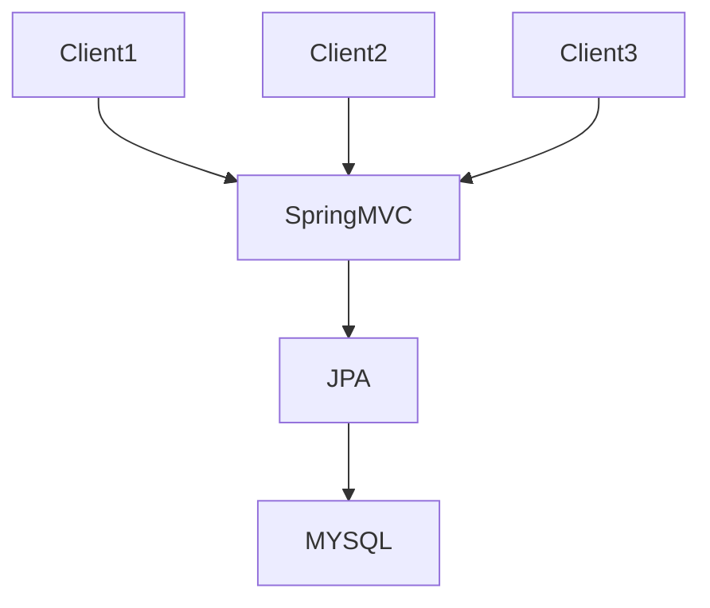
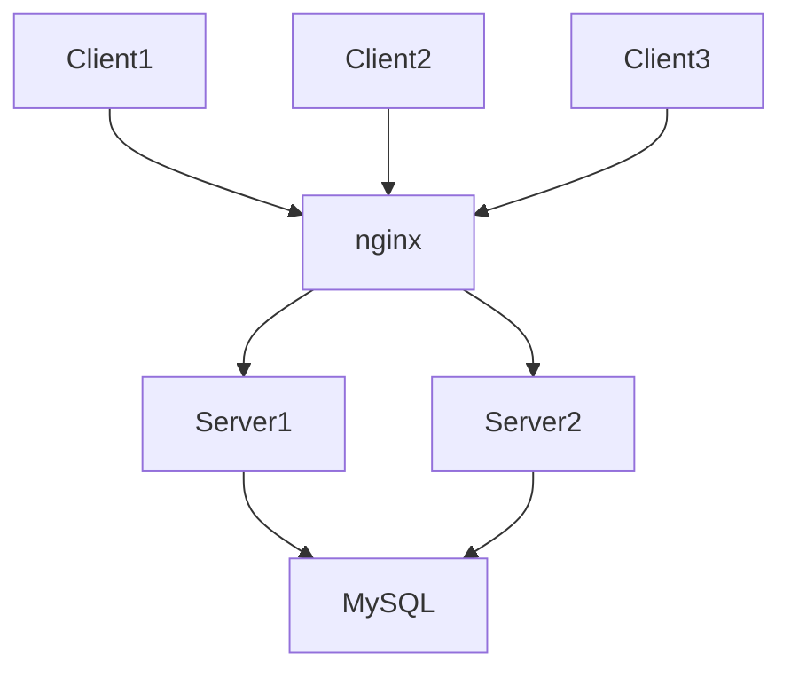
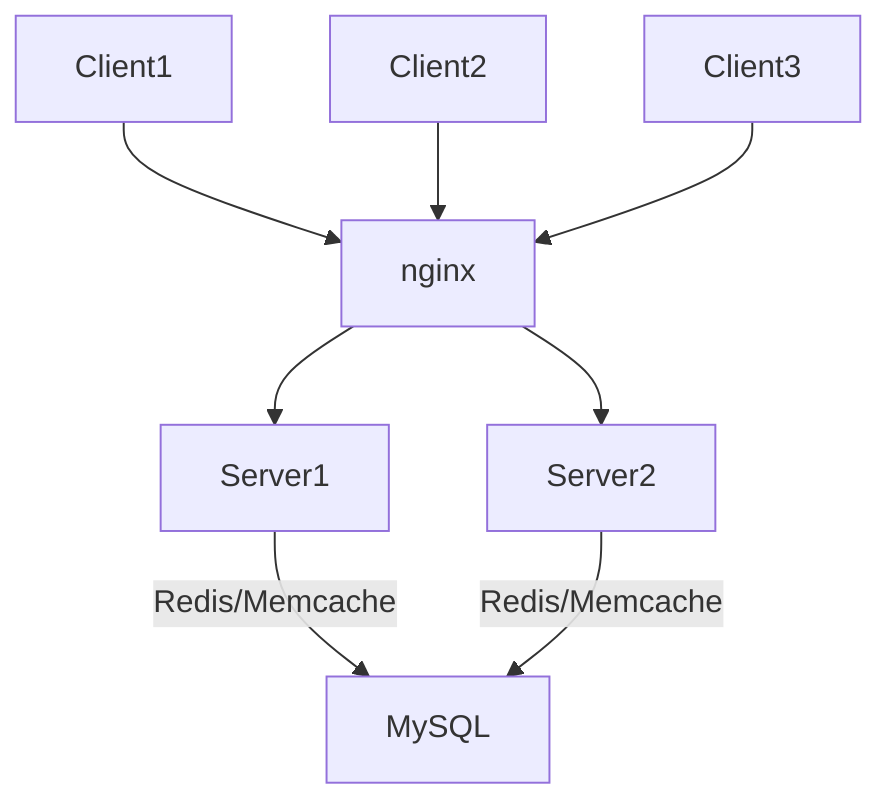
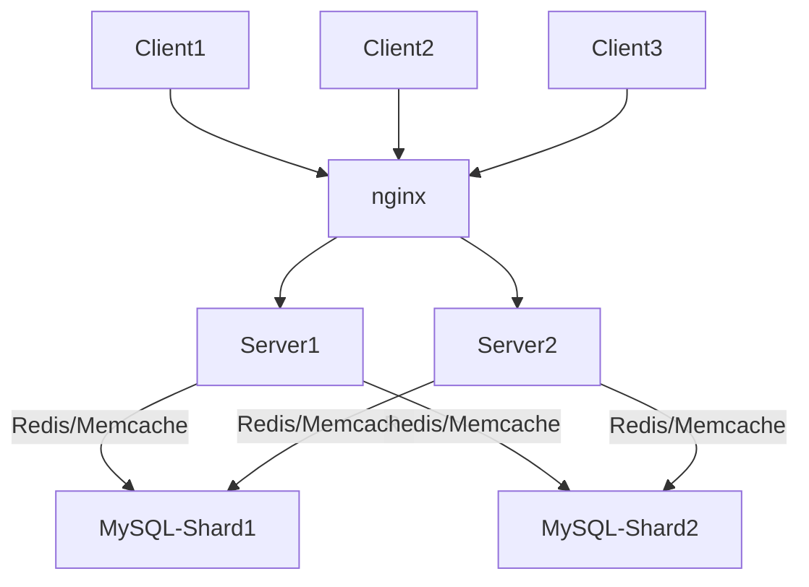

# 架构演进

## 1. 最初架构

最开始业务比较简单，那么可以采用单体应用。

SpringMVC + JPA + Mysql




## 2. 添加负载均衡

随着用户量的增加，服务器负载增加，使用nginx反向代理，将负载分摊到各个server上。



## 3. 添加缓存

当请求数再增加，MySQL的I/O成为瓶颈。 可以考虑添加缓存，缓存复杂sql的查询结果。 一般可以采用Redis/Memcache作为分布式缓存。



## 4. 读写分离

当有些请求穿透缓存到DB， 导致MySQL的负载高，读写比较慢。此时可以对MySQL进行读写分离。

```mermaid
graph TD;
   Client1-->nginx;
   Client2-->nginx;
	Client3-->nginx;
	nginx-->Server1;
	nginx-->Server2;
	Server1--Write-->MySQL-Master;
    Server1--Read--Redis/Memcache-->MySQL-Slaves;
    Server2--Write-->MySQL-Master;
    Server2--Read--Redis/Memcache-->MySQL-Slaves;
```

## 5. MySQL Sharding

当业务量变大，单张表数据量达到百万，可以对数据库或者表进行分库分表，以减少单张表查询效率低。一般根据某个字段对shardingCount取模，或者hash之后取模，来计算某一条记录应该放到哪台机器的DB。 应用可以采用sharding的中间件来做db的路由。 例如shark，Atlas，cobar，TDDL、sharding-jdbc等。




